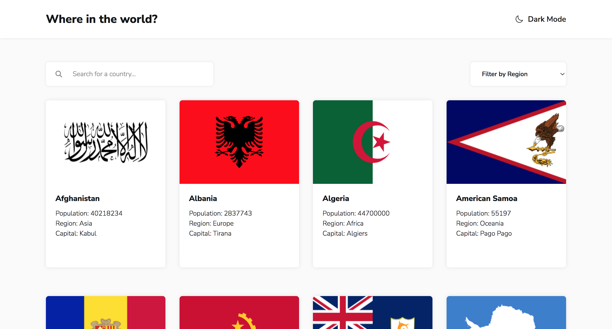
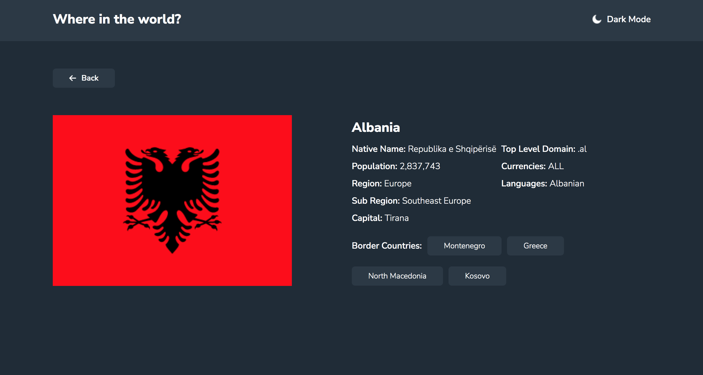
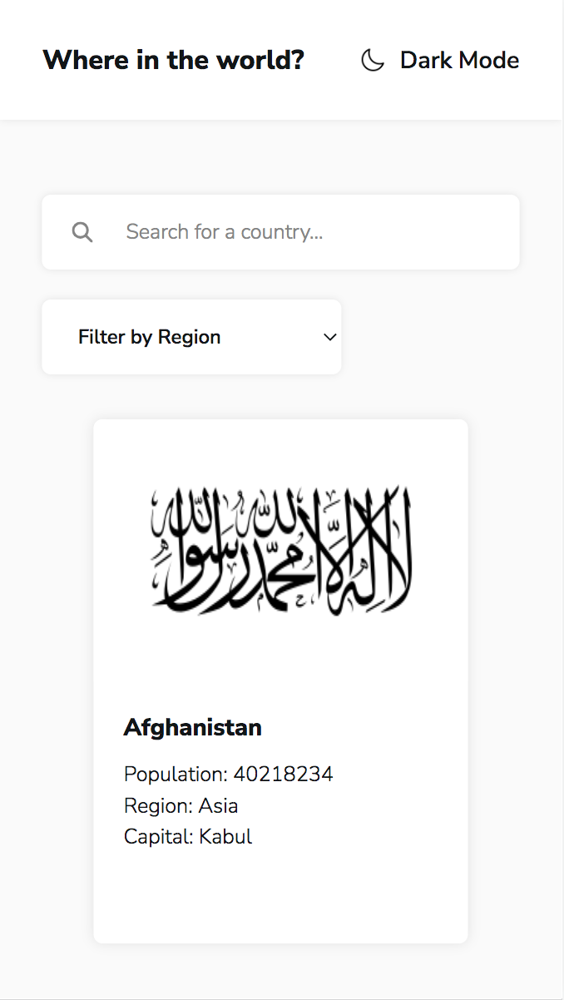
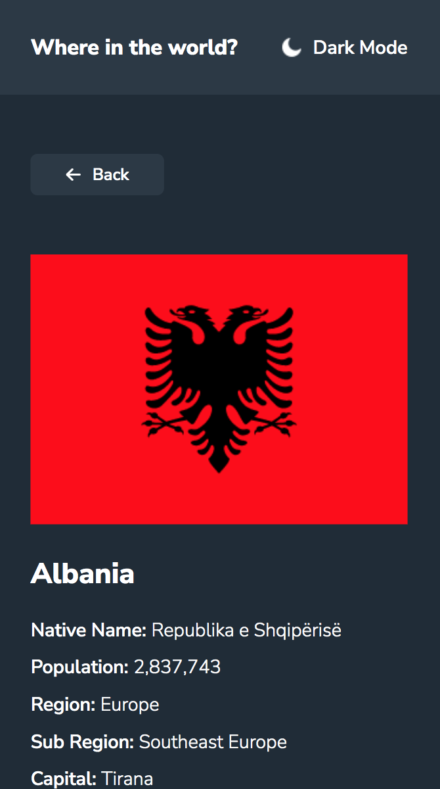

# Frontend Mentor - REST Countries API with color theme switcher solution

This is a solution to the [REST Countries API with color theme switcher challenge on Frontend Mentor](https://www.frontendmentor.io/challenges/rest-countries-api-with-color-theme-switcher-5cacc469fec04111f7b848ca).

## Table of contents

- [Overview](#overview)
  - [Screenshot](#screenshot)
  - [Links](#links)
- [My process](#my-process)
  - [Function](#function)
  - [Built with](#built-with)
- [Author](#author)

## Overview

### Screenshot

Desktop 💻  

Mobile 📱  

### Links

- Live Site URL: [Click me !](https://beckyyyyy.github.io/react-countries-api/)

## My process

### Function

1. 首頁可以查看所有國家清單 (一次顯示 24 筆，若需查看更多可點擊 "more")
2. 可以透過搜尋國家名字，或使用 Filter by region 查看特定國家清單。
3. 點擊任意國家，將進入詳細資訊頁。
4. 詳細資訊頁除顯示國家資訊，也顯示周圍國家，可以點擊周圍國家進入該國詳細資料頁。
5. 點擊上放顯示模式按鈕，可以切換日間模式與深夜模式。

### Built with

- Built with React
- CSS Modules
- axios API
- Responsive web design

## Author

- [Website](https://beckyyyyy.github.io/portfolio/)
- [Gmail](nkes50723@gmail.com)
